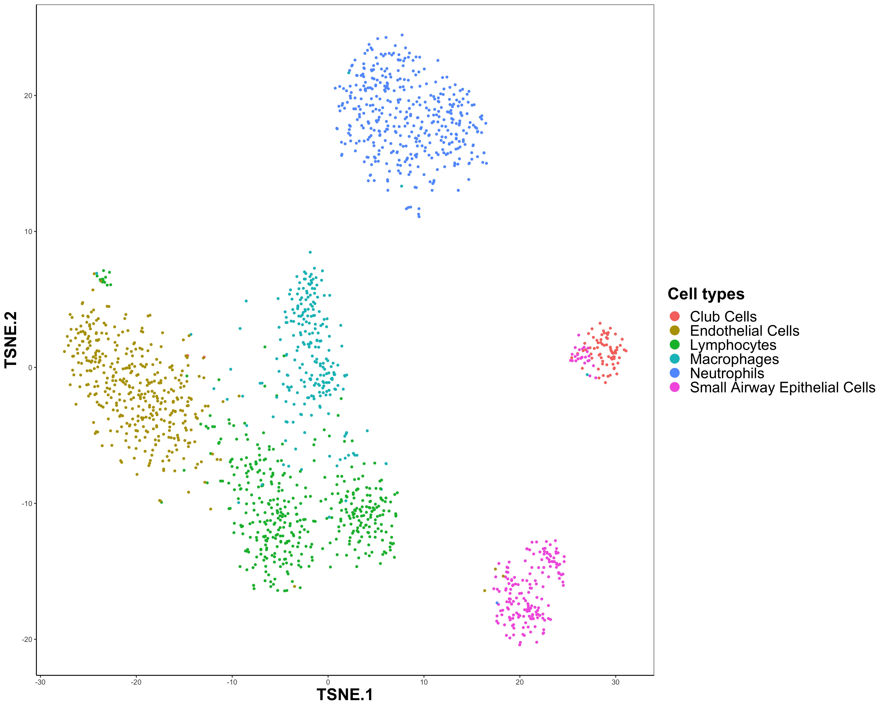

\tableofContents

```{r, include = FALSE}
knitr::opts_chunk$set(
  collapse = TRUE,
  comment = "#>"
)
```

# Introduction

Single-cell RNA sequencing (scRNA-seq) has revolutionized biological research by 
enabling the measurement of transcriptomic profiles at the single-cell level. 
Appropriately clustering cells on scRNA-seq data with multiple subjects could be
a problem in larger scale studies.
Subject-specific variation is the most challenging one.
It could have a significant impact on clustering accuracy when
systematic heterogeneity from multiple subjects exists. 
Though there are several methods seeking to address such effects 
most of them suffer from several limitations.

EDClust is designed for multi-subject scRNA-seq cell clustering.
EDClust adopts a Dirichlet-multinomial mixture model and explicitly accounts for cell type heterogeneity, 
subject heterogeneity, and clustering uncertainty. 
EDClust pipeline mainly includes three steps: (A). input data. (B). initialize parameters. (C). clustering. 
Based on an EM and MM hybrid framework, EDClust offers functions for predicting cell type labels, 
estimating parameters of effects from different sources, and posterior probabilities for cells being in each cluster.

```{r, flowchart, echo=FALSE}
library(knitr)
include_graphics("flowchart2.jpg")
```

# Installation and help

## Install EDClust
To install this package, start R and enter:

```{r install, eval = FALSE}
library(devtools)
install_github("weix21/EDClust")
library(EDClust)
```

## Install Julia

EDClust requires a working installation of Julia. This can be easily done via:

```{r setupjulia, eval = FALSE}
julia <- setup_julia() 
```

which will automatically install both Julia and the required Julia packages if they are missing. 

If you want to setup Julia manually, you can download a generic binary from https://julialang.org/downloads/. 
Before using an existing Julia binary, make sure that Julia is found in the path. Then you can do 

```{r localjulia, eval = FALSE}
julia <- setup_julia(path = "the folder that contains Julia binary") 
```

For more information about Julia setup, 
please see the `julia_setup()` function from [**JuliaCall**](https://github.com/Non-Contradiction/JuliaCall) package, 
which provides an R interface to Julia.

If you plan to update EDClust to newest version, after updating, please also specify `Update = TRUE` to update the related EDClust's Julia package version.

```{r updatejulia, eval = FALSE}
julia <- setup_julia(Update = TRUE) 
```


## Help for EDClust

Any EDClust questions should be posted
to the GitHub Issue section of EDClust 
https://github.com/weix21/EDClust/issues.

# Using EDClust for scRNA-seq clustering analysis

EDClust requires a pre-processed count expression matrix with rows representing the genes and columns representing the cells, 
and an array containing subject ID information. 
Here's we show an example in `Mlung_sub` dataset step by step.

## Setup the package 

EDClust utilizes EDClust.jl for its core routines and provides a direct wrapper over EDClust.jl. 
You need to do initial setup by function `setup_julia()`. 
You could also use an existing Julia binary by specifying the `path`.

```{r loadpackage, eval = TRUE}
library(EDClust)
```

```{r setup, eval = FALSE}
julia <- setup_julia(path = "the folder that contains Julia binary") 
```

## Load the data

The `Mlung_sub` dataset is loaded with three objects including the count expression matrix (`count_all_notna`), corresponding cell type information (`annot_all_notna`) and subject ID information (`subject_all_notna`). This dataset is pre-processed by [**FEAST**](https://github.com/suke18/FEAST), which filters out the genes based on the dropout rate and infers the gene-level significance. Here we obtain the top 500 features for clustering.

```{r loaddata, eval = TRUE}
data("Mlung_sub")
dim(count_all_notna)
table(subject_all_notna)
table(annot_all_notna)
```

## Feature selection

FEAST, as a newly developed feature selection tool, shows superior performance in substantial real data analyses. Therefore EDClust uses FEAST for feature selection and its main functions is embedded in function `FEAST_select()`.

```{r feature_selection, eval = FALSE}
data <- FEAST_select(count, subject, Ncluster = 6, Nfeature = 500)
```

FEAST bascially provides two functions for feature selection: `FEAST()` and `FEAST_fast()`, and `FEAST_select()` inherits most of their arguments. For extreme large dataset (sample size >5000), `FEAST_fast()` will be automatically applied. In our real data analyses, we could obtain satisfactory results with only 500 features, and thus we use `Nfeature` = 500 by default.

## Baseline selection and Initialize parameters

EM algorithm often suffers from locally optimal solutions while EDClust is based an EM and MM hybrid framework. 
Thus it is necessary to provide appropriate initial values for the parameter estimations, 
especially the cell type-specific effect $\alpha_0$. 
Unsupervised clustering methods will be applied on the selected baseline subject to obtain initial clusters.
We recommend using  [**SHARP**](https://github.com/shibiaowan/SHARP)
as the unsupervised clustering method because of its good computational performance.
And then EDClust will compute the initial value for $\alpha_0$ based on the clustering results.

Though commonly baseline subject selections won't have great impact on clustering,
when the selected baseline subject has low signal-to-noise 
and lead to bad SHAPR clustering, 
we fail to obtain well informative initial values for the model parameters 
and therefore EDClust is more likely to be stuck at local optimal solutions. 
We provide a method to select the best possible subject as the baseline, 
based on F-test on the SHARP clusters.

```{r baseselect, eval = FALSE}
baseID <- Baseline_select(count_all_notna, subject_all_notna, Ncluster = 6)
```

Since subject 2 has the greatest score, 
we select subject 2 as the baseline subject for parameter initialization.

Using function `InitVal_S()` will automatically run SHARP and compute the initial value for $\alpha_0$.
You could specify the number of clusters, baseline subject and seed for SHARP.

```{r initialization, eval = FALSE}
alpha_0 <- InitVal_S(count_all_notna, subject_all_notna, Ncluster = 6, ID = 2, seed = 2345) 
```

It is noted that though `SHARP` is recommended,
You could also use function `InitVal()` to 
compute the initial values based on clustering results obtained from other methods. 

## Clustering

After computing the initial values, we can use function `FitPolya()` for clustering. 
The results provides predicted cell label (`mem`); the log likelihood (`loglik`); 
estimations of cell type-specific effects (`alpha_0`), subject-specific effects (`delta`) as well as overall effect (`alpha`);
and the probability that each cell belongs to each cluster (`p`).

```{r clustering, eval = FALSE}
result <- FitPolya(count_all_notna, subject_all_notna, alpha_0, BaseID = 2L)
```

Based on the clustering results, we can benchmark the performance of EDClust by ARI. 
And The t-SNE plot can also be shown as: 
  
```{r ARI, eval = FALSE}
library(mclust)
adjustedRandIndex(result$mem, annot_all_notna)
```

```{r, TSNE, echo = FALSE}

```

# Session Info
```{r}
sessionInfo()
```
